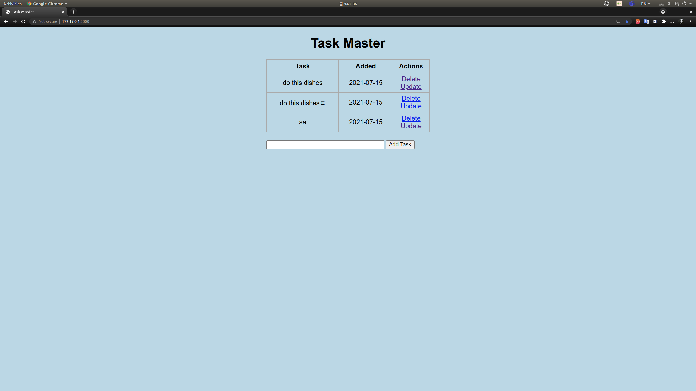

# DevOps 구성

## 웹 화면



# **I. 프로젝트 기능**

- Task를 넣으면 Task 이름과 추가 한 날짜가 입력
- 추가된 Task는 Delete로 지울 수 있고, Update로 수정 가능

## **앞으로 추가할 기능**

> 추후에 도서 추천 시스템의 정보를 얻는 웹으로 수정할 예정입니다.

- 선호하는 책을 고르는 기능
- 책 정보와 해당 책을 선택한 사람의 정보를 추가
- 비슷한 사람이 읽은 책을 추천

## **필요 기능**

- 드래그 앤 드롭 UI
- 소셜 로그인
- 실시간 랭킹

# **II. 구성**

## **파일 구조**

```
├── README.md
├── templates 	    
│   ├── base.html     
│   ├── index.html     
│   └── update.html   
├── app.py     	    
├── requirements.txt    
├── test.db     	    
└── Dockerfile     
```